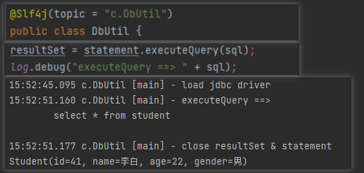

# 手动编写 mybatis 功能

## 1. 准备工作


### (1) 工程 pom.xml 文件处理

> 引入 xml 文件和 xpath 解析的依赖，将 mybatis 作用范围限制在测试阶段

```xml
  <dependencies>
<!--    解析xml文件-->
    <dependency>
      <groupId>dom4j</groupId>
      <artifactId>dom4j</artifactId>
      <version>1.6.1</version>
    </dependency>
<!--    解析xpath-->
    <dependency>
      <groupId>jaxen</groupId>
      <artifactId>jaxen</artifactId>
      <version>1.2.0</version>
    </dependency>
<!--    取消从父工程引入的 mybatis / 将 mybatis 作用范围限制在测试阶段-->
    <dependency>
      <groupId>org.mybatis</groupId>
      <artifactId>mybatis</artifactId>
      <version>3.5.7</version>
      <scope>test</scope> <!--测试范围-->
    </dependency>
    <!--  其它依赖-->
    <dependency>
      <groupId>mysql</groupId>
      <artifactId>mysql-connector-java</artifactId>
      <version>8.0.26</version>
    </dependency>
    <dependency>
      <groupId>org.projectlombok</groupId>
      <artifactId>lombok</artifactId>
      <version>1.18.22</version>
    </dependency>
    <dependency>
      <groupId>junit</groupId>
      <artifactId>junit</artifactId>
      <version>3.8.1</version>
      <scope>test</scope>
    </dependency>
  </dependencies>
```

### (2) 创建模型层

```java
@Data
public class Student {
    private int id;
    private String name;
    private int age;
    private String gender;
}
```

### (3) 创建一个 Mapper 接口

```java
public interface StudentMapper {
    List<Student> selectList();
}
```

### (4) 创建一个 Mapper.xml 配置文件

```xml
<?xml version="1.0" encoding="UTF-8" ?>
<mapper namespace="com.slz.mybatis.mapper.StudentMapper">
    <select id="selectList" resultType="com.slz.mybatis.model.Student">
        select * from student
    </select>
</mapper>
```

### (5) 创建 mybatis-config.xml 全局配置文件

```xml
<?xml version="1.0" encoding="UTF-8"?>
<configuration>
    <environments default="dev">
        <environment id="dev">
            <transactionManager type="JDBC"></transactionManager>
            <dataSource type="POOLED">
                <property name="driver" value="com.mysql.cj.jdbc.Driver"/>
                <!--& 相当于一个 & ，这里需要采用此方法来转义-->
                <property name="url" value="jdbc:mysql://localhost:3306/Mybatis?rewriteBatchStatements=true&serverTimeZone=GMT%2B8&useSSL=false"/>
                <property name="username" value="root"/>
                <property name="password" value="root"/>
            </dataSource>
        </environment>
    </environments>
    <mappers>
        <mapper resource="com/slz/mybatis/mapper/StudentMapper.xml"></mapper>
    </mappers>
</configuration>
```

## 2. 具体实现

见 mybatis-impl 模块

### （1）日志功能

日志功能：

pom.xml

```xml
      <dependency>
          <groupId>ch.qos.logback</groupId>
          <artifactId>logback-classic</artifactId>
          <version>1.2.7</version>
      </dependency>
```

logback.xml（直接放在 resources 下面）

```xml
<?xml version="1.0" encoding="UTF-8"?>
<!--日志格式处理-->
<configuration
        xmins="http://ch.qos.logback/xml/ns/logback"
        xmlns:xsi="http://www.w3.org/2001/XMLSchema-instance"
        xsi:schemaLocation="http://ch.qos.logback/xml/ns/logback logback.xsd">
    <appender name="STDOUT" class="ch.qos.logback.core.ConsoleAppender">
        <encoder>
            <pattern>%date{HH:mm:ss.SSS} %c [%t] - %m%n</pattern>
        </encoder>
    </appender>
    <logger name="c" level="debug" additivity="false">
        <appender-ref ref="STDOUT"/>
    </logger>
    <root leveL="ERROR">
        <appender-ref ref="STDOUT"/>
    </root>
</configuration>
```

使用：



### （2）注解功能

```xml
    <mappers>
<!--     扫描xml   -->
<!--        <mapper resource="com/slz/project/mapper/StudentMapper.xml"></mapper>-->
<!--        扫描java类-->
        <mapper class="com.slz.project.mapper.StudentDao"></mapper>
    </mappers>
```

```java
    private static Map<String, Mapper> getMapperAnnotations(String classPath){
        // com.slz.project.mapper.StudentDao
        Map<String, Mapper> mappers = new HashMap<>();
        try {
            Class<?> aClass = Class.forName(classPath);
            Method[] methods = aClass.getMethods();
            for (Method method : methods) {
                boolean annotationPresent = method.isAnnotationPresent(Select.class); // 是否被是 Select 注解
                if(annotationPresent){
                    Mapper mapper = new Mapper();
                    Select select = method.getAnnotation(Select.class);
                    String sql = select.value();
                    Type genericReturnType = method.getGenericReturnType(); // 获取当前方法返回类型的泛型
                    if(genericReturnType instanceof ParameterizedType){ // 判断是不是参数化类型（泛型）
                        ParameterizedType parameterizedType = (ParameterizedType) genericReturnType;
                        // 获取运行时的实际泛型类型
                        Type[] actualTypeArguments = parameterizedType.getActualTypeArguments();
                        Class actualTypeArgument = (Class) actualTypeArguments[0];
                        String name = actualTypeArgument.getName();

                        mapper.setClassName(name).setSqlStatement(sql);
                    }
                    String key = method.getDeclaringClass().getName() + "." + method.getName();
                    mappers.put(key, mapper);
                }
            }
            return mappers;
        } catch (ClassNotFoundException e) {
            throw new RuntimeException(e);
        }
    }
```

```java
public class Test_annotation {
    public static void main(String[] args) {
        // 获取资源配置文件 mybatis-config.xml 的输入流
        InputStream resourceAsStream = Resources.getResourceAsStream("mybatis-config.xml");
        SqlSession sqlSession = new SqlSessionFactoryBuilder().build(resourceAsStream).openSession();
        StudentDao mapper = sqlSession.getMapper(StudentDao.class);
        List<Student> students = mapper.selectList();
        students.forEach(System.out::println);
    }
}
```


+++++++++++++++++++++++++++
