# MybatisLearning

# 一、Mybatis 持久层框架

> 学习框架前的预备知识：
>
> - 数据库（mysql、oracle）技术；
> - IDEA 开发工具；
> - Maven 工具；
> - xml 文件；
> - Java 注解 @；

- mybatis 本身是 apache 开源项目 ibatis，2010 年由 apache software foundation 迁移到 google code，并改名为 mybatis；
- 2013 年 11 月迁移到 github；
- mybatis 是开源的**持久层框架**；

#### 1. 与其它持久层框架的对比

- hibernate: 全自动框架，面向对象；
- spring data jpa: 基于hibernate实现；
- mybatis: 半自动框架，专注于sql的编写和优化；
  - 支持定制化sql、存储过程、高级映射；
  - mybatis 避免掉几乎所有 jdbc 的代码；
  - 可以使用简单的 xml 文件或者注解来配置和映射原生信息，将接口和 POJO（Plain Ordinary Java Object,就是 JavaBean 对象） 映射成数据库中的记录；

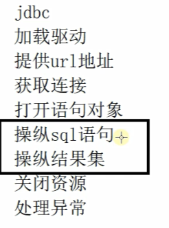

> mybatis 只关注 SQL语句

#### 2. ORM 对象关系映射

持久层框架，也被称作 ORM（Object Relational Mapping） 框架；

> 为什么使用框架？
>
> - 专注于 SQL：开发者可以专注于 SQL 语句的编写，而不是处理诸如连接管理、预编译语句设置等繁琐的任务；
> - 清晰的 SQL 语句：MyBatis 将 SQL 语句与 Java 代码分离，使得 SQL 更加清晰且易于维护；
> - 易于上手和集成：它可以很容易地与 Spring 等其他 Java 框架集成，形成一套完整的开发解决方案；

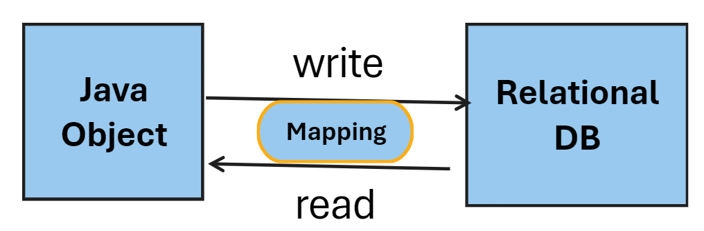

#### 3. Mybatis 功能架构

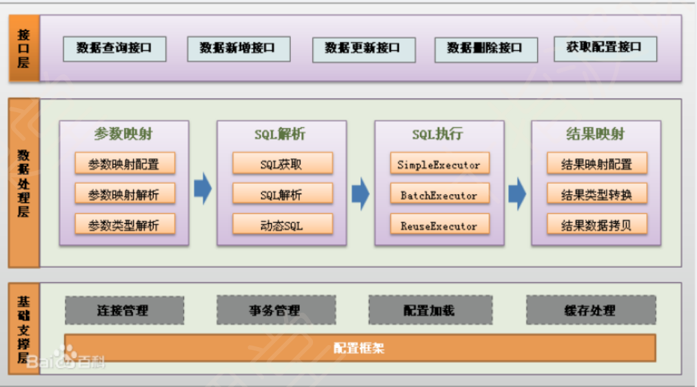

1. 基础支撑层：负责最基础的功能支撑，包括连接管理、事务管理、配置加载和缓存处理。将系统共用的抽取出来作为最基础的组件。为上层的数据处理层提供支撑。
2. 数据处理层：负责具体的 sql 查找、sql 解析、sql 执行和执行结果映射处理等。主要目的是根据调用的请求完成一次数据库操作；
3. API 接口层：提供给外部使用的 API，开发人员通过这些 API 来操纵数据库，接口层一接收到调用请求就会调用数据处理层来完成具体的数据处理；

#### 4. Mybatis 工作流程

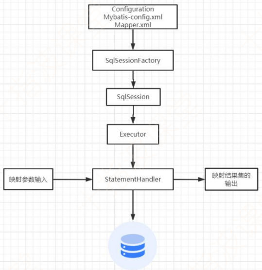

#### 5. Mybatis 入门程序

> Lombok 介绍：
>
> Lombok 是一个 Java 库，它能够帮助开发者减少在 Java 中常见的冗余代码，比如 getter、setter、构造器、equals 和 hashcode 方法等。通过简单的注解，Lombok 能够自动生成这些方法，从而让代码更加简洁和可读。常见的注解包括 `@Getter`、`@Setter`、`@NoArgsConstructor`、`@AllArgsConstructor` 等。
>
> - 简化代码、注解驱动：使用 Lombok 可以显著减少样板代码的数量，使类定义更加简洁，例如，可以通过 `@Data` 注解来自动为类生成 getter、setter、toString、equals 和 hashCode 方法。
> - 即时编译：Lombok 在编译阶段生成所需的代码，因此不会影响运行时的表现。在 IDE 中看不到生成的代码，它们也会在编译后的字节码中出现。
> - 易于集成：集成 Lombok 到项目中通常只需要添加依赖并安装相应的 IDE 插件即可；

###### (1) 环境准备

创建一个 maven 工程；

依赖导入：

- 官网：[Maven Repository: mybatis (mvnrepository.com)](https://mvnrepository.com/search?q=mybatis)或者
- 使用 IDEA 插件 Maven Search

配置 pom.xml 文件：

```xml
<dependencies>
    <dependency>
      <groupId>junit</groupId>
      <artifactId>junit</artifactId>
      <version>3.8.1</version>
      <scope>test</scope>
    </dependency>
    <dependency>
      <groupId>org.mybatis</groupId>
      <artifactId>mybatis</artifactId>
      <version>3.5.7</version>
    </dependency>
    <dependency>
      <groupId>org.projectlombok</groupId>
      <artifactId>lombok</artifactId>
      <version>1.18.22</version>
    </dependency>
    <dependency>
      <groupId>mysql</groupId>
      <artifactId>mysql-connector-java</artifactId>
      <version>8.0.26</version>
    </dependency>
  </dependencies>
  <build>
    <resources>
      <resource>
        <directory>src/main/java</directory>
        <includes>
          <include>**/*.properties</include>
          <include>**/*.xml</include>
        </includes>
        <filtering>false</filtering>
      </resource>
    </resources>
  </build>
```

###### (2) 在 IDEA 中创建配置文件模板

1. config.xml 文件模板

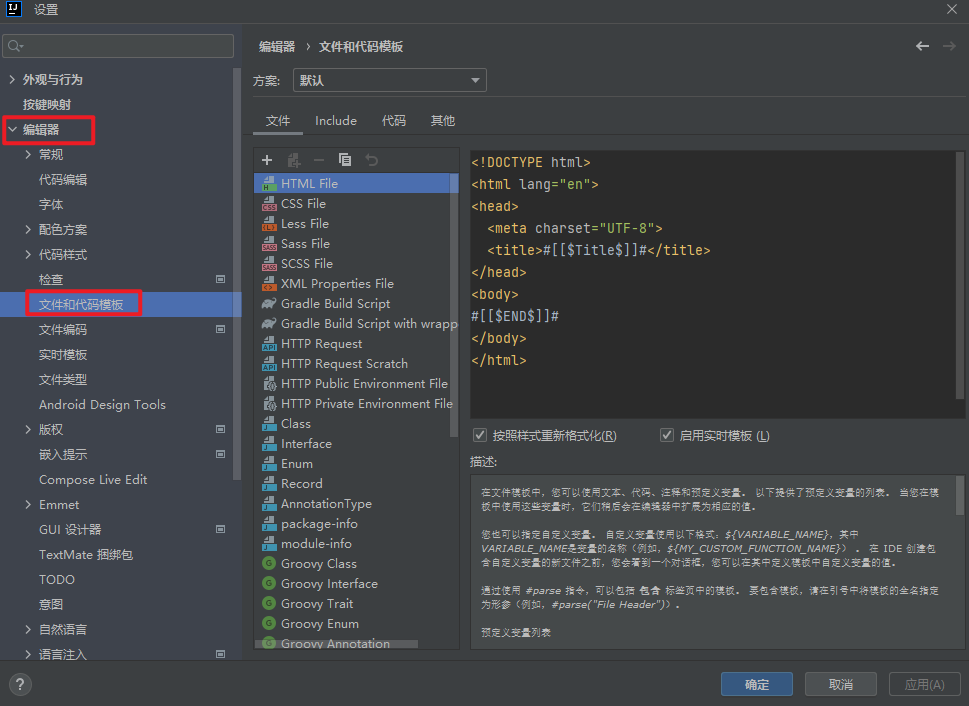

```xml
<?xml version="1.0" encoding="UTF-8"?>
<!DOCTYPE configuration PUBLIC "-//mybatis.org//DTD Config 3.0//EN"
        "http://mybatis.org/dtd/mybatis-3-config.dtd">
<configuration>
</configuration>
```

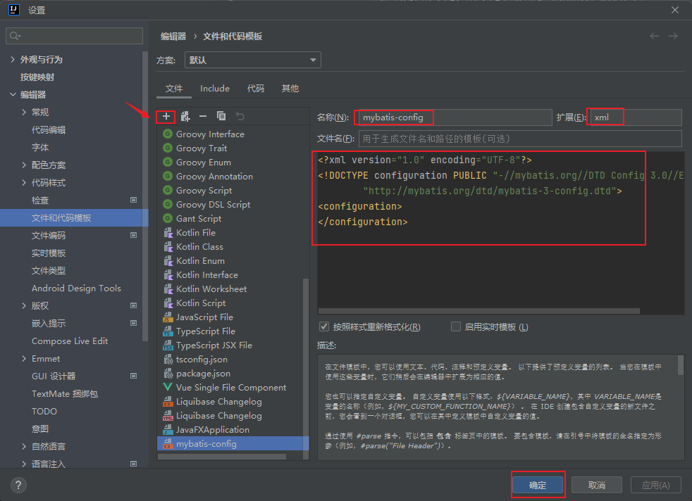

3. mapper.xml 文件模板

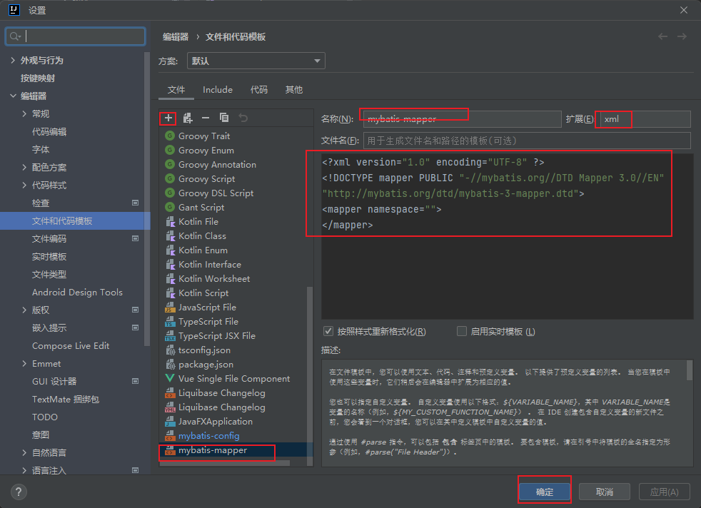

##### (3) config.xml 文件配置

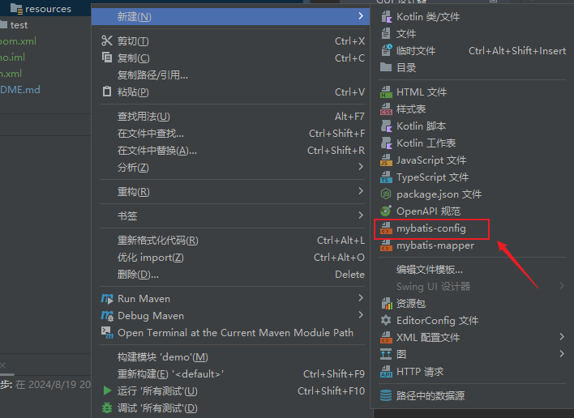

```xml
<?xml version="1.0" encoding="UTF-8"?>
<!DOCTYPE configuration PUBLIC "-//mybatis.org//DTD Config 3.0//EN"
        "http://mybatis.org/dtd/mybatis-3-config.dtd">
<configuration>
    <properties resource="db.properties"></properties>
    <environments default="dev">
        <environment id="dev">
            <transactionManager type="JDBC"></transactionManager>
            <dataSource type="POOLED">
                <property name="driver" value="${mysql.driver}"/>
                <property name="url" value="${mysql.url}"/>
                <property name="username" value="${mysql.user}"/>
                <property name="password" value="${mysql.password}"/>
            </dataSource>
        </environment>
<!--        <environment id="prod">-->
<!--            <transactionManager type=""></transactionManager>-->
<!--            <dataSource type=""></dataSource>-->
<!--        </environment>-->
<!--        <environment id="test">-->
<!--            <transactionManager type=""></transactionManager>-->
<!--            <dataSource type=""></dataSource>-->
<!--        </environment>-->
    </environments>
</configuration>
```

> 其中，`${}`属性读取，是从 `db.properties` 文件中读取，便于统一维护和管理；

##### (4) mapper.xml 编写 sql 语句

创建 model 类：

> 这里使用 lombok 注解和插件

```java
@Data
public class Student {
    private int id;
    private String name;
    private int age;
    private String gender;
}

```

在 mapper.xml 文件中编写 sql：

```xml
<?xml version="1.0" encoding="UTF-8" ?>
<!DOCTYPE mapper PUBLIC "-//mybatis.org//DTD Mapper 3.0//EN"
        "http://mybatis.org/dtd/mybatis-3-mapper.dtd">
<mapper namespace="test">
    <select id="selectAll" resultType="com.slz.model.Student">
        select * from student;
    </select>
</mapper>
```

在 config.xml 中引入此 mapper:

```xml
    <mappers>
        <mapper resource="student_mapper.xml"></mapper>
    </mappers>
```

执行程序：

```java
public class App {
    public static void main( String[] args ) throws IOException {
        // 输入流读取 Mybatis 配置文件，用于建立连接
        InputStream inputStream = Resources.getResourceAsStream("Mybatis-Config.xml");
        // 通过 Session 工厂构造器构造工厂
        SqlSessionFactoryBuilder builder = new SqlSessionFactoryBuilder();
        SqlSessionFactory factory = builder.build(inputStream);
        // 打开 Session
        SqlSession session = factory.openSession();
        // 执行 sql
        List<Student> list = session.selectList("selectAll"); // 传入 对应 sql id
        // 打印结果
        list.forEach(System.out::println);
        session.close();
    }
}
```

# 二、Mybatis 单表的增删改查

### 1. 单表数据插入

#### (1) 直接插入数据

```xml
    <insert id="insert">
        insert into student
        values (default, '张龙', 25, '女');
    </insert>
```

```java
public class TestInsert {
    public static void main(String[] args) throws IOException {
        InputStream inputStream = Resources.getResourceAsStream("Mybatis-Config.xml");
        SqlSessionFactoryBuilder builder = new SqlSessionFactoryBuilder();
        SqlSessionFactory build = builder.build(inputStream);
        SqlSession session = build.openSession(); // 这里自动提交，默认是关闭的，所以需要手动提交
        int insert = session.insert("insert");
        System.out.println(insert > 0 ? "成功" : "失败");
        session.commit(); // 查询对原来数据没有影响不需要提交事务，但是插入不是
        session.close();
    }
}
```

#### (2) 插入对象数据（单表传参插入数据）

```xml
    <insert id="insertObject" parameterType="com.slz.model.Student">
        insert into student values (default, #{name}, #{age}, #{gender});
    </insert>
```

```java
public class SessionUtil {
    public static SqlSession getSession(Boolean isAutoCommit) throws IOException {
        InputStream inputStream = Resources.getResourceAsStream("Mybatis-Config.xml");
        SqlSessionFactoryBuilder builder = new SqlSessionFactoryBuilder();
        SqlSessionFactory build = builder.build(inputStream);
        SqlSession session = build.openSession(isAutoCommit); // 这里设置事务是否自动提交，默认是关闭的,true 是开启自动提交
        return session;
    }
}
```

```java
@Data
@Accessors(chain = true) // 链式编程，允许类对象作链式处理（调用结果返回当前对象就可以）
@AllArgsConstructor // 给该类加一个包含所有参数的构造方法
@NoArgsConstructor // 给该类加一个无参的构造方法
public class Student {
    private int id;
    private String name;
    private int age;
    private String gender;

    // 下面代码 可解释 @Accessors(chain = true)
//    public Student setAge(int age) {
//        this.age = age;
//        return this;
//    }
}
```

```java
public class TestInsertObj {
    public static void main(String[] args) throws IOException {
        SqlSession session = SessionUtil.getSession(true);
        Student student = new Student();
        Student student1 = student.setName("陈维").setAge(25).setGender("男");
        int insertObject = session.insert("insertObject", student1);
        System.out.println(insertObject>0 ? "y" : "n");
        session.close();
    }
}
```

### 2. Mybatis 处理细节

#### (1) update / delete / insert 标签没有区别 ❤️

- mybatis 中 mapper.xml 文件，不区分insert update delete 元素名的；
- mybatis 中用到 session 的相关方法，insert update detele 都是调用到底层的 update 方法；

> ❤️ 对于 Mybatis 框架，update / delete / insert 是采用同样的方式，所以 mapper.xml 的三种标签 和 session 的三种方法没有区别;
>
> 其执行的实际效果取决于具体的 sql 语句；

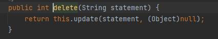

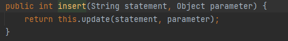

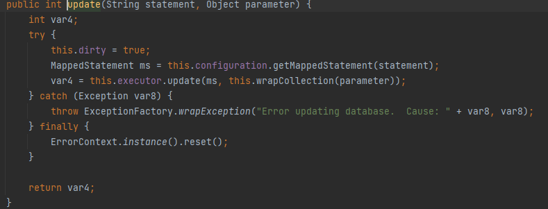

```xml
    <insert id="insertObject" parameterType="com.slz.model.Student">
        insert into student values (default, #{name}, #{age}, #{gender});
    </insert>
    <update id="insertObject" parameterType="com.slz.model.Student">
        insert into student values (default, #{name}, #{age}, #{gender});
    </update>
    <delete id="insertObject" parameterType="com.slz.model.Student">
        insert into student values (default, #{name}, #{age}, #{gender});
    </delete>
```

#### (2) 配置打印日志 ⭐️

在 config.xml 下配置，注意顺序，setting 放在 properties 下面，符合 DTD 规范；

> DTD（Document Type Definition，文档类型定义）是一种用于定义 XML 文档结构的标准。DTD 可以用来定义 XML 文档中允许的元素、元素的属性、元素之间的关系以及其他规则。使用 DTD 可以确保 XML 文档符合预定的结构要求，从而保证文档的一致性和有效性;

```xml
    <settings>
        <setting name="logImpl" value="STDOUT_LOGGING"/>
    </settings>
```

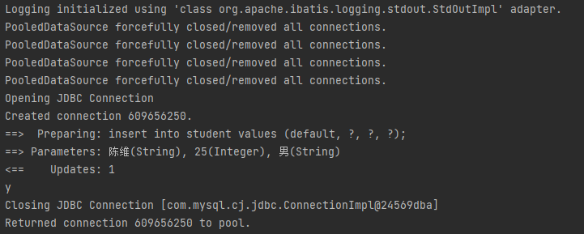

#### (3) 参数传递时 # 和 $ 的区别 ❤️

> - 使用 #: 相当于使用 ? 占位，后面再传递参数; (推荐👍)
> - 使用 $: 相当于用拼接 sql 的方式，连成一条 sql 语句;

使用 # 传参：

```xml
    <insert id="insertObject" parameterType="com.slz.model.Student">
        insert into student values (default, #{name}, #{age}, #{gender});
    </insert>
```

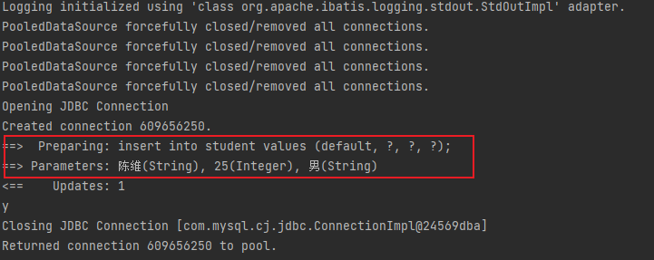

使用 $ 传参：此处由于name 和 gender 是字符串型，要加单引号；

```xml
    <insert id="insertObject1" parameterType="com.slz.model.Student">
        insert into student values (default, '${name}', ${age}, '${gender}');
    </insert>
```

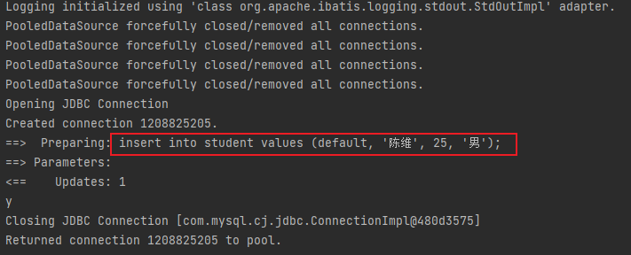

### 3. 插入数据后获取 ID

Mysql 中有一个查询语句，可以获取最后一次插入的ID值：

```sql
insert into student values (default, '陈维', 25, '男');
SELECT LAST_INSERT_ID();
```

所以可以在 mapper.xml 中设置：

```xml
    <insert id="insertAndGetId" parameterType="com.slz.model.Student">
        <selectKey keyProperty="id" keyColumn="id" resultType="int" order="AFTER">
            SELECT LAST_INSERT_ID();
        </selectKey>
        insert into student values (default, #{name}, #{age}, #{gender});
    </insert>
```

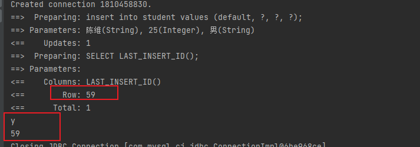

### 4. 删除数据处理

```xml
    <delete id="delete" parameterType="int">
        delete from student where id=#{id}
    </delete>
```

```java
public class TestDelete {
    public static void main(String[] args) throws IOException {
        SqlSession session = SessionUtil.getSession(true);
        int delete = session.delete("delete", 59);
        session.close();
    }
}
```

### 5. 更新数据处理

```xml
    <update id="update" parameterType="com.slz.model.Student">
        update student set `name`=#{name}, age=#{age}, gender=#{gender} where id=#{id};
    </update>
```

```java
public class TestUpdate {
    public static void main(String[] args) throws IOException {
        SqlSession session = SessionUtil.getSession(true);
        Student student = new Student(51, "张大仙", 25, "女");
        int update = session.update("update", student);
        session.close();
    }
}
```

### 6. 查询数据处理

```xml
    <select id="selectList" resultType="com.slz.model.Student">
       select * from student;
    </select>
    <select id="selectById" resultType="com.slz.model.Student" parameterType="int">
        select * from student where id=#{id}
    </select>
```

```java
public class TestSelect {
    public static void main(String[] args) throws IOException {
        SqlSession session = SessionUtil.getSession(true);
//        List<Student> selectList1 = session.selectList("selectList");
//        selectList1.forEach(student -> System.out.print(student));
        Student selectById = session.selectOne("selectById", 58);
        System.out.println(selectById);
        session.close();
    }
}
```

# 三、Mybatis 使用 DAO 或者 Mapper 方式

## 1. DAO

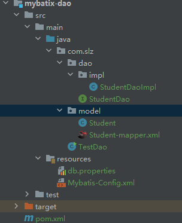

- DAO 接口

```java
public interface StudentDao {
    default SqlSession getSqlSession() { // 默认手动提交事务
        try {
            return new SqlSessionFactoryBuilder().build(Resources.getResourceAsStream("Mybatis-Config.xml")).openSession();
        } catch (IOException e) {
            throw new RuntimeException(e);
        }
    }
    default SqlSession getSqlSession(Boolean isAuto) {
        try {
            return new SqlSessionFactoryBuilder().build(Resources.getResourceAsStream("Mybatis-Config.xml")).openSession(isAuto);
        } catch (IOException e) {
            throw new RuntimeException(e);
        }
    }
    int save(Student student);
    int delete(int id);
    int update(Student student);
    List<Student> selectList();
    Student selectId(int id);
}
```

- DAO 实现类

```java
public class StudentDaoImpl implements StudentDao {

    @Override
    public int save(Student student) {
        SqlSession session = getSqlSession();
        int i = session.insert("save", student);
        session.commit();
        session.close();
        return i;
    }

    @Override
    public int delete(int id) {
        SqlSession session = getSqlSession();
        int i = session.delete("delete", id);
        session.commit();
        session.close();
        return i;
    }

    @Override
    public int update(Student student) {
        SqlSession session = getSqlSession();
        int i = session.update("update", student);
        session.commit();
        session.close();
        return i;
    }

    @Override
    public List<Student> selectList() {  // 查询不需要 commit Tx
        SqlSession session = getSqlSession();
        List<Student> selectList = session.selectList("selectList");
        session.close();
        return selectList;
    }

    @Override
    public Student selectId(int id) {
        SqlSession session = getSqlSession();
        Student selectId = session.selectOne("selectId", id);
        session.close();
        return selectId;
    }
}
```

## 2. Mapper ❤️

> 允许程序员只编写接口，而不需要编写实现类。由 mybatis 自动生成一个代理实现类，操纵接口中的方法。

要求：

1. mapper.xml 文件中 namespace 必须是接口的全路径；

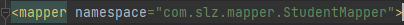

2. 接口中的方法名必须和 mapper.xml 文件中的 statementId 相同；

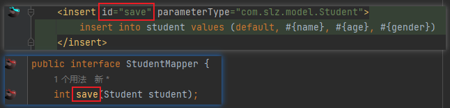

3. 接口中的方法参数必须和 mapper.xml 文件中 parameterType 相同；
4. 接口中的方法返回值类型必须和 mapper.xml 文件中 resultType 匹配；
5. 在 config.xml 文件中配置 mapper，可以通过配置包的方式实现：要求 mapper.xml 和 mapper 接口在同一个包下，且同名；

```xml
    <mappers>
<!--        <mapper resource="com/slz/mapper/StudentMapper.xml"></mapper>-->
        <package name="com.slz.mapper"/>
    </mappers>
```

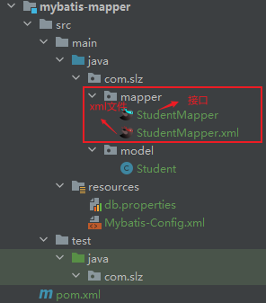

测试程序：

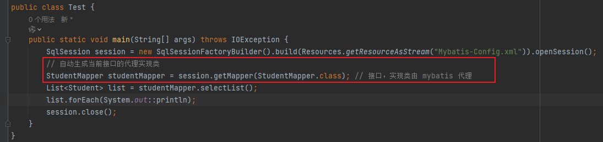

## 3. Mybatis 配置类的别名

在 config.xml 中配置：

```xml
    <!-- 配置别名-->
    <typeAliases>
<!--        <typeAlias type="com.slz.model.Student" alias="Student"></typeAlias>-->
        <!--别名就是类名，且不区分大小写-->
        <package name="com.slz.model"/>
    </typeAliases>
```

配置之后，在 mapper.xml 中就可以只写别名：

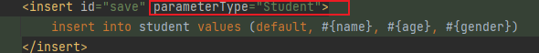

# 四、Mybatis 使用注解方式

结构：

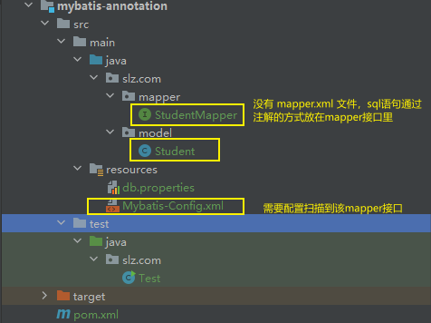

mapper 接口：

```java
public interface StudentMapper {
    @Insert("intser into student values(default, #{name}, #{age}, #{gender})")
    int save(Student student);
    @Delete("delete from student where id=#{id}")
    int delete(int id);
    @Update("update student set `name`=#{name}, age=#{age}, gender=#{gender} where id=#{id}")
    int update(Student student);
    @Select("select * from student order by age")
    List<Student> selectList();
    @Select("select * from student where id=#{id}")
    Student selectById(int id);
}
```

配置 config.xml 文件：

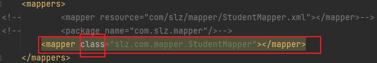

# 五、动态拼接 Sql

## 1. if

> if, 执行多分支的0个或者多个

```xml
    <select id="selectCondition" resultType="Student" parameterType="Student">
            select * from student where 1=1
            <if test="name!=null and name!=''">
                and name like '%'#{name}'%'
            </if>
            <if test="age!=null and age!=0">
                and age=#{age}
            </if>
            <if test="gender!=null and gender!=''">
                and gender=#{gender}
            </if>
    </select>
```

## 2. choose-when-otherwise

> 类似于 switch ，只执行多分支其中的一个

```xml
    <select id="selectConditionChoose" resultType="com.slz.dynamic.model.Student">
            select * from student where 1=1
            <choose>
                <when test="name!=null and name!=''">
                    and name like '%'#{name}'%'
                </when>
                <when test="age!=null and age!=0">
                    and age=#{age}
                </when>
                <when test="gender!=null and gender!=''">
                    and gender=#{gender}
                </when>
                <otherwise>
                    order by age
                </otherwise>
            </choose>
    </select>
```

## 3. where

> 将判断条件放在 where 标签内，防止 where 和 and 直接拼接引发的错误

```xml
    <select id="selectConditionWhere" resultType="com.slz.dynamic.model.Student">
        select * from student
        <where>
            <if test="name!=null and name!=''">
                and name like '%'#{name}'%'
            </if>
            <if test="age!=null and age!=0">
                and age=#{age}
            </if>
            <if test="gender!=null and gender!=''">
                and gender=#{gender}
            </if>
        </where>
    </select>
```

## 4. trim

> trim 用于在该标签内语句前后，添加/删除 前缀/后缀；
>
> trim 标签内的条件判断在命中条件时，prefix 属性是添加 where，prefixOverrides 属性去掉 where 之后的 and；

```xml
    <select id="selectConditionTrim" resultType="com.slz.dynamic.model.Student">
        select * from student
        <trim prefix="where" prefixOverrides="and">
            <if test="name!=null and name!=''">
                and name like '%'#{name}'%'
            </if>
            <if test="age!=null and age!=0">
                and age=#{age}
            </if>
            <if test="gender!=null and gender!=''">
                and gender=#{gender}
            </if>
        </trim>
    </select>
```

## 5. set

```xml
    <update id="update" parameterType="com.slz.dynamic.model.Student">
        update student
        <set>
            <if test="name!=null">`name`=#{name},</if>
            <if test="age!=null and age!=0">age=#{age},</if>
            <if test="gender!=null">gender=#{gender}</if>
        </set>
        where id = #{id}
    </update>
    <update id="updateTrim" parameterType="com.slz.dynamic.model.Student">
        update student
        <trim prefix="set" suffixOverrides=",">
            <if test="name!=null">`name`=#{name},</if>
            <if test="age!=null and age!=0">age=#{age},</if>
            <if test="gender!=null">gender=#{gender}</if>
        </trim>
        where id = #{id}
    </update>
```

## 6. forEach

### (1) 批量删除

#### a. 数组方式

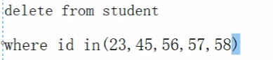

```xml
    <delete id="deleteCheck" >
        delete
        from student
        <where>
            <foreach collection="array" item="id" open="and id in(" close=")" separator=",">
                #{id}
            </foreach>
        </where> 
    </delete>
```


```xml
    <delete id="deleteCheckOr" >
        delete
        from student
        <where>
            <foreach collection="array" item="sid" open="and (" close=")" separator="or">
                id=#{sid}
            </foreach>
        </where>
    </delete>
```


#### b. 集合方式

```xml
    <delete id="deleteCheckList" >
        delete
        from student
        <where>
            <foreach collection="list" item="sid" open="and (" close=")" separator="or">
                id=#{sid}
            </foreach>
        </where>
    </delete>
```

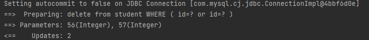

### (2) 批量插入

> ❗️不适合大数据量和字段非常多的数据，资源消耗非常大

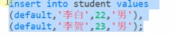

```xml
    <insert id="insertBatch">
        insert into student values
        <foreach collection="list" item="stu" separator=",">
            (default, #{stu.name}, #{stu.age}, #{stu.gender})
        </foreach>
    </insert>
```

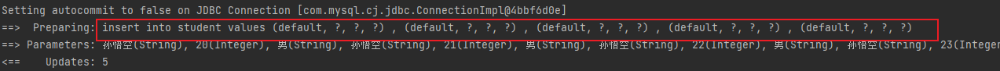

## 7. bind

根据名字模糊查询：

```xml
    <select id="selectByName" parameterType="com.slz.dynamic.model.Student" resultType="com.slz.dynamic.model.Student">
        select * from student
        <where>
            <if test="name!=null and name!=''">
                and `name` like concat('%',#{name}, '%')
            </if>
        </where>
    </select>
```

使用 bind 改进：

```xml
    <select id="selectByNameBind" parameterType="com.slz.dynamic.model.Student" resultType="com.slz.dynamic.model.Student">
        select * from student
        <bind name="search_name" value="'%'+name+'%'"></bind>
        <where>
            <if test="name!=null and name!=''">
                and `name` like #{search_name}
            </if>
        </where>
    </select>
```

## 8. sql 片

> ⭐️ 可以将重复的sql片段单独封装在 sql 标签里，并赋予一个标识名，然后在需要用到的地方使用 include 标签通过标识名导入该代码片段；

```xml
    <sql id="selectAll">
        select * from student where age>18
    </sql>
    <select id="count" resultType="long">
        select count(*) from
        <trim prefix="(" suffix=") as ss">
            <include refid="selectAll"></include>
        </trim>
    </select>
```

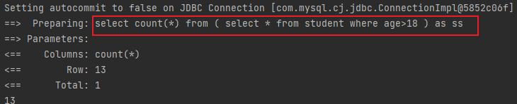

## 9. 使用注解实现 sql 动态拼接

方式1：`<script></script>`包围

```xml
    @Select("<script>" +
            "select * from student" +
            "<where>" +
            "<if test=\"name!=null and name!=''\">" +
            "and `name` like #{name}" +
            "</if>" +
            "<if test=\"age!=null and age!=0\">" +
            "and age=#{age}" +
            "</if>" +
            "</where>" +
            "</script>")
    List<Student> selectByAnnotation(Student student);
```

方式2：{} 包围

```xml
    @Select({"<script>",
            "select * from student",
            "<where>",
            "<if test=\"name!=null and name!=''\">",
            "and `name` like #{name}",
            "</if>",
            "<if test=\"age!=null and age!=0\">",
            "and age=#{age}",
            "</if>",
            "</where>",
            "</script>"})
    List<Student> selectByAnnotation(Student student);
```

# 六、Mybatis 处理表的关联关系

## 1. 一对一表关系处理

> java 一般按照细粒度设计；数据库粗粒度设计；这涉及到降低联表查询的概率，因为联表查询性能低于单表查询；

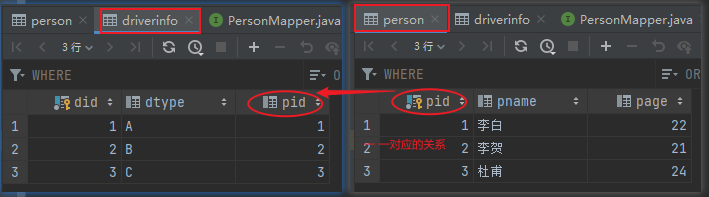

### （1）查询

```sql
select * from person p join driverinfo d on p.pid = d.pid;
```

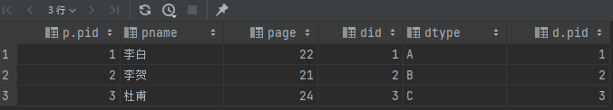

> 联表查询，返回结果类型处理

#### 1. 新建一个类，用于接收返回结果

- 两个或多个类的属性放在一起到新建的类；
- 或者采用继承的方式；

```java
@Data
public class PersonDriver extends DriverInfo{
    private int pid;
    private String pname;
    private int page;

    @Override
    public String toString() {
        return "PersonDriver{" +
                "pid=" + pid +
                ", pname='" + pname + '\'' +
                ", page=" + page +
                "} " + super.toString();
    }
}
```

```java
public interface PersonMapper {
    @Select("select * from person p join driverinfo d on p.pid = d.pid")
    List<PersonDriver> selectList();
}
```

#### 2. mapper.xml 中使用 resultMap 标签配置 ❤️

> 继承 + 组合的方式

```java
@Data
public class DriverQuery extends DriverInfo{ // 继承
    private Person person; // 组合

    @Override
    public String toString() {
        return "DriverQuery{" +
                "person=" + person +
                "} " + super.toString();
    }
}
```

> 配置 mapper.xml resultMap 标签，结果映射（不能直接使用 DriverQuery 类作为返回结果类型的原因是，该组合类 Person 的属性拿不到）

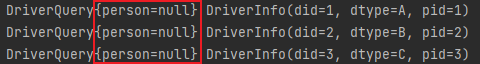

```xml
<?xml version="1.0" encoding="UTF-8" ?>
<!DOCTYPE mapper PUBLIC "-//mybatis.org//DTD Mapper 3.0//EN"
        "http://mybatis.org/dtd/mybatis-3-mapper.dtd">
<mapper namespace="com.slz.one.mapper.DriverInfoMapper">
    <resultMap id="DriverQuery" type="com.slz.one.model.DriverQuery">
        <id property="did" column="did"></id>
        <result property="dtype" column="dtype"></result>
        <association property="person" javaType="com.slz.one.model.Person">
            <id property="pid" column="pid"></id>
            <result property="pname" column="pname"></result>
            <result property="page" column="page"></result>
        </association>
    </resultMap>
    <select id="selectList" resultMap="DriverQuery">
        select * from person p join driverinfo d on p.pid = d.pid
    </select>
</mapper>
```

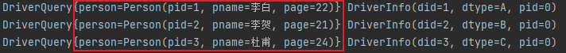

> 配置自动映射（当属性名和字段名一样是时可以使用）

```xml
<?xml version="1.0" encoding="UTF-8" ?>
<!DOCTYPE mapper PUBLIC "-//mybatis.org//DTD Mapper 3.0//EN"
        "http://mybatis.org/dtd/mybatis-3-mapper.dtd">
<mapper namespace="com.slz.one.mapper.DriverInfoMapper">
    <resultMap id="DriverQuery" type="com.slz.one.model.DriverQuery" autoMapping="true">
        <association property="person" javaType="com.slz.one.model.Person" autoMapping="true">
        </association>
    </resultMap>
    <select id="selectList" resultMap="DriverQuery">
        select * from person p join driverinfo d on p.pid = d.pid
    </select>
</mapper>
```

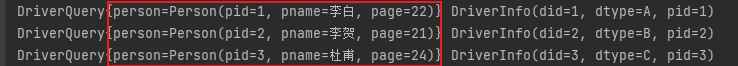

## 2. 一对多表关系处理

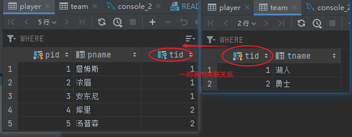

### （2）查询

> 一对多表的联表查询结果使用对象集合List组合到返回了类型中；

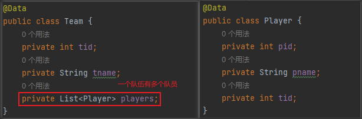

> mapper.xml 配置，使用 resultMap 标签的 collection 标签；:star:

```xml
<?xml version="1.0" encoding="UTF-8" ?>
<!DOCTYPE mapper PUBLIC "-//mybatis.org//DTD Mapper 3.0//EN"
        "http://mybatis.org/dtd/mybatis-3-mapper.dtd">
<mapper namespace="com.slz.multi.mapper.TeamMapper">
    <resultMap id="rTeam" type="com.slz.multi.model.Team">
        <id property="tid" column="tid"></id>
        <result property="tname" column="tname"></result>
        <collection property="players" ofType="com.slz.multi.model.Player" autoMapping="true">
        </collection>
    </resultMap>
    <select id="selectList" resultMap="rTeam">
        select *
        from team t
                 join player p on t.tid = p.tid
    </select>
</mapper>
```

```java
public class Test {
    public static void main(String[] args) throws IOException {
        SqlSession session = new SqlSessionFactoryBuilder().build(Resources.getResourceAsStream("Mybatis-Config.xml")).openSession();
        TeamMapper mapper = session.getMapper(TeamMapper.class);
        List<Team> teams = mapper.selectList();
        teams.forEach(System.out::println);
        session.close();
    }
}
```

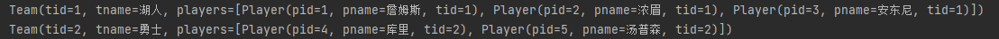

## 3. 多对多的表关系处理

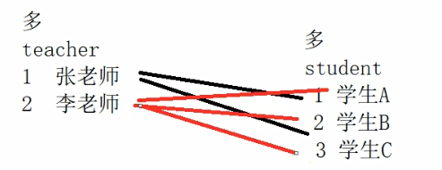

> - 从老师的角度看，一个老师可以教多个学生，是一对多的关系；
> - 从学生的角度看，一个学生可以有多个老师，也是一对多的关系；
> - 从整体来看，这是一个多对多的关系；

所以，在java程序处理角度，其处理逻辑与一对多的处理逻辑是一样的。但是从数据库表设计的角度则需要考虑的就多了。:heart:

### （1）多对多关系的数据库表设计 ❤️

> 为了防止冗余信息的，通常通过添加中间表来解决；:star:


示例：用户表和角色表

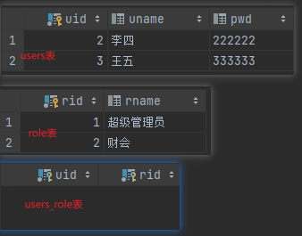


#### a. 主外键关联的删除处理

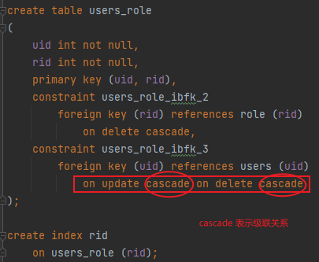

> 删除 / 更新的级联关系，当关联外键发生变化，自身相应改变

# 七、逆向工程配置及生成

> - maven 依赖配置：https://mvnrepository.com/artifact/org.mybatis.generator/mybatis-generator-maven-plugin/1.4.0
> - `mybatis-generator-maven-plugin`

## 1. pom.xml 文件配置

> 主要是< build > 标签配置

```xml
<project xmlns="http://maven.apache.org/POM/4.0.0" xmlns:xsi="http://www.w3.org/2001/XMLSchema-instance"
  xsi:schemaLocation="http://maven.apache.org/POM/4.0.0 http://maven.apache.org/maven-v4_0_0.xsd">
  <modelVersion>4.0.0</modelVersion>
  <groupId>com.slz.generator</groupId>
  <artifactId>mybatis-generator</artifactId>
  <version>1.0-SNAPSHOT</version>
  <name>mybatis-generator</name>
  <url>http://maven.apache.org</url>

  <dependencies>
    <dependency>
      <groupId>org.mybatis</groupId>
      <artifactId>mybatis</artifactId>
      <version>3.5.7</version>
    </dependency>
    <dependency>
      <groupId>org.projectlombok</groupId>
      <artifactId>lombok</artifactId>
      <version>1.18.22</version>
    </dependency>
    <dependency>
      <groupId>mysql</groupId>
      <artifactId>mysql-connector-java</artifactId>
      <version>8.0.26</version>
    </dependency>
  </dependencies>

  <build>
    <plugins>
      <plugin>
        <!-- https://mvnrepository.com/artifact/org.mybatis.generator/mybatis-generator-maven-plugin -->
          <groupId>org.mybatis.generator</groupId>
          <artifactId>mybatis-generator-maven-plugin</artifactId>
          <version>1.4.0</version>
          <configuration>
            <!--配置文件的位置-->
            <configurationFile>src/main/resources/generatorConfig.xml</configurationFile>
            <verbose>true</verbose>
            <overwrite>true</overwrite>
          </configuration>
        <executions>
          <execution>
            <id>Generate MyBatis Artifacts</id>
            <goals>
              <goal>generate</goal>
            </goals>
          </execution>
        </executions>
        <dependencies>
          <dependency>
            <groupId>org.mybatis.generator</groupId>
            <artifactId>mybatis-generator-core</artifactId>
            <version>1.4.0</version>
          </dependency>
          <dependency>
            <groupId>log4j</groupId>
            <artifactId>log4j</artifactId>
            <version>1.2.17</version>
          </dependency>
        </dependencies>
      </plugin>
    </plugins>

    <resources>
      <resource>
        <directory>src/main/java</directory>
        <includes>
          <include>**/*.properties</include>
          <include>**/*.xml</include>
        </includes>
        <filtering>false</filtering>
      </resource>
    </resources>
  </build>
</project>

```

## 2. generatorConfig.xml 配置文件

配置文件模板：https://mybatis.org/generator/configreference/xmlconfig.html，根据需要修改

```xml
<?xml version="1.0" encoding="UTF-8"?>
<!DOCTYPE generatorConfiguration
        PUBLIC "-//mybatis.org//DTD MyBatis Generator Configuration 1.0//EN"
        "http://mybatis.org/dtd/mybatis-generator-config_1_0.dtd">

<generatorConfiguration>
    <!--配置 mysql 驱动jar包位置-->
    <classPathEntry location="C:\Users\SunLZ\.m2\repository\mysql\mysql-connector-java\8.0.26\mysql-connector-java-8.0.26.jar"/>

    <context id="MysqlTables" targetRuntime="MyBatis3">
        <!--配置 mysql 数据库连接-->
        <jdbcConnection driverClass="com.mysql.cj.jdbc.Driver"
                        connectionURL="jdbc:mysql://localhost:3306/Mybatis?rewriteBatchStatements=true&serverTimeZone=GMT%2B8&useSSL=false"
                        userId="root"
                        password="root">
        </jdbcConnection>

        <javaTypeResolver >
            <property name="forceBigDecimals" value="false" />
        </javaTypeResolver>

        <!--配置生成的 model 层-->
        <javaModelGenerator targetPackage="com.slz.generator.model" targetProject=".\src\main\java">
            <property name="enableSubPackages" value="true" />
            <property name="trimStrings" value="true" />
        </javaModelGenerator>

        <!--配置生成的 mapper 层(xml文件)-->
        <sqlMapGenerator targetPackage="com.slz.generator.mapper"  targetProject=".\src\main\java">
            <property name="enableSubPackages" value="true" />
        </sqlMapGenerator>
        <!--配置生成的 mapper 层(java接口)-->
        <javaClientGenerator type="XMLMAPPER" targetPackage="com.slz.generator.mapper"  targetProject=".\src\main\java">
            <property name="enableSubPackages" value="true" />
        </javaClientGenerator>

        <!--配置数据库表-->
        <table tableName="student"></table>

    </context>
</generatorConfiguration>
```

## 3. 运行插件

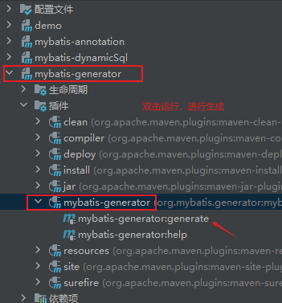


> 运行结果

```yaml
[INFO] Scanning for projects...
[INFO] 
[INFO] ----------------< com.slz.generator:mybatis-generator >-----------------
[INFO] Building mybatis-generator 1.0-SNAPSHOT
[INFO] --------------------------------[ jar ]---------------------------------
[INFO] 
[INFO] --- mybatis-generator-maven-plugin:1.4.0:generate (default-cli) @ mybatis-generator ---
[INFO] Connecting to the Database
[INFO] Introspecting table student
[INFO] Generating Example class for table student
[INFO] Generating Record class for table student
[INFO] Generating Mapper Interface for table student
[INFO] Generating SQL Map for table student
[INFO] Saving file StudentMapper.xml
[INFO] Saving file StudentExample.java
[INFO] Saving file Student.java
[INFO] Saving file StudentMapper.java
[INFO] ------------------------------------------------------------------------
[INFO] BUILD SUCCESS
[INFO] ------------------------------------------------------------------------
[INFO] Total time:  6.398 s
[INFO] Finished at: 2024-09-09T19:23:34+08:00
[INFO] ------------------------------------------------------------------------

进程已结束,退出代码0

```

## 4. 用生成的代码实现 增删改查

```java
public class Test {
    public static void main(String[] args) throws IOException {
        SqlSession session = new SqlSessionFactoryBuilder().build(Resources.getResourceAsStream("Mybatis-Config.xml")).openSession();
        StudentMapper mapper = session.getMapper(StudentMapper.class);
        Student student = mapper.selectByPrimaryKey(47);
        System.out.println(student.toString());
        session.close();
    }
}
```

# 八、Mybatis 缓存问题 ❤️

## 1. 一级缓存

> 一级缓存：查询的结果存在 SqlSession 中，
>
> - 随着 SqlSession 关闭，缓存失效；
> - 调用增加、删除、修改、commit()、close()、clearCache()方法时，清空一级缓存；


> 上述第二次查询时就是直接从一级缓存里读数据的；
>
> 当在第二次相同的查询之前，调用了 commit()，就会清空一级缓存，则第二次查询仍然向数据库发送并执行 sql 语句；

```java
public class TestCache {
    public static void main(String[] args) throws IOException {
        SqlSessionFactoryBuilder builder = new SqlSessionFactoryBuilder();
        SqlSessionFactory build = builder.build(Resources.getResourceAsStream("Mybatis-Config.xml"));
        SqlSession session = build.openSession();
        StudentMapper mapper = session.getMapper(StudentMapper.class);
        List<Student> students = mapper.selectByExample(null);
        students.forEach(System.out::println);
        System.out.println("-----------------------------------");
//        session.commit();
        // 再次查询打印
        mapper = session.getMapper(StudentMapper.class);
        students = mapper.selectByExample(null);
        students.forEach(System.out::println);
        session.close();
    }
}
```

## 2. 二级缓存

> 二级缓存：查询的结果存在 SqlSessionFactory 中，
>
> - 一级缓存只有同一个 session 可以访问到；
> - 二级缓存可以被不同的 session 访问到；
> - 适用于数据量较大，且不是实时的数据，如银行交易记录、历史通话记录 ❤️


### （1）mybatis 打开二级缓存

1. 修改 Mybatis-Config.xml 文件：

```xml
    <settings>
        <setting name="logImpl" value="STDOUT_LOGGING"/>
        <setting name="cacheEnabled" value="true"/>
    </settings>
```

2. 修改 mapper.xml 文件：

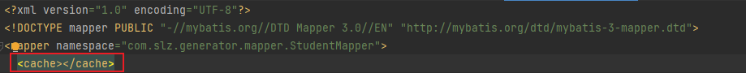

> 添加< cache > 标签，就打开二级缓存了；

3. 实体类（model层）需要能被序列化，Serializable 接口；

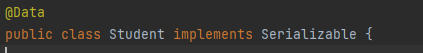

### （2）mybatis 测试二级缓存

```java
public class TestCache {
    public static void main(String[] args) throws IOException {
        SqlSessionFactoryBuilder builder = new SqlSessionFactoryBuilder();
        SqlSessionFactory build = builder.build(Resources.getResourceAsStream("Mybatis-Config.xml"));
        SqlSession session = build.openSession();
        StudentMapper mapper = session.getMapper(StudentMapper.class);
        List<Student> students = mapper.selectByExample(null);
        students.forEach(System.out::println);
        session.close();

        System.out.println("-----------------------------------");

        // 再次查询打印
        session = build.openSession();
        mapper = session.getMapper(StudentMapper.class);
        students = mapper.selectByExample(null);
        students.forEach(System.out::println);
        session.close();

        System.out.println("-----------------------------------");

        // 再次查询打印
        session = build.openSession();
        mapper = session.getMapper(StudentMapper.class);
        students = mapper.selectByExample(null);
        students.forEach(System.out::println);
        session.close();
    }
}
```

```yaml
Created connection 1601687801.
Setting autocommit to false on JDBC Connection [com.mysql.cj.jdbc.ConnectionImpl@5f77d0f9]
==>  Preparing: select id, name, age, gender from student
==> Parameters: 
<==    Columns: id, name, age, gender
<==        Row: 41, 李白, 22, 男
<==        Row: 42, 李贺, 23, 男
<==        Row: 43, 李太白, 22, 女
<==        Row: 44, 李贺, 23, 男
<==        Row: 47, 李商隐, 50, 男
<==        Row: 48, 陆游, 22, 女
<==      Total: 6
Student(id=41, name=李白, age=22, gender=男)
Student(id=42, name=李贺, age=23, gender=男)
Student(id=43, name=李太白, age=22, gender=女)
Student(id=44, name=李贺, age=23, gender=男)
Student(id=47, name=李商隐, age=50, gender=男)
Student(id=48, name=陆游, age=22, gender=女)
Resetting autocommit to true on JDBC Connection [com.mysql.cj.jdbc.ConnectionImpl@5f77d0f9]
Closing JDBC Connection [com.mysql.cj.jdbc.ConnectionImpl@5f77d0f9]
Returned connection 1601687801 to pool.
-----------------------------------
As you are using functionality that deserializes object streams, it is recommended to define the JEP-290 serial filter. Please refer to https://docs.oracle.com/pls/topic/lookup?ctx=javase15&id=GUID-8296D8E8-2B93-4B9A-856E-0A65AF9B8C66
Cache Hit Ratio [com.slz.generator.mapper.StudentMapper]: 0.5
Student(id=41, name=李白, age=22, gender=男)
Student(id=42, name=李贺, age=23, gender=男)
Student(id=43, name=李太白, age=22, gender=女)
Student(id=44, name=李贺, age=23, gender=男)
Student(id=47, name=李商隐, age=50, gender=男)
Student(id=48, name=陆游, age=22, gender=女)
-----------------------------------
Cache Hit Ratio [com.slz.generator.mapper.StudentMapper]: 0.6666666666666666
Student(id=41, name=李白, age=22, gender=男)
Student(id=42, name=李贺, age=23, gender=男)
Student(id=43, name=李太白, age=22, gender=女)
Student(id=44, name=李贺, age=23, gender=男)
Student(id=47, name=李商隐, age=50, gender=男)
Student(id=48, name=陆游, age=22, gender=女)

进程已结束,退出代码0

```

其中，后两次查询都命中了二级缓存；

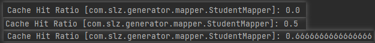

> 三次查询的缓存命中率，在运行结果中可以看出来，表示在这几次查询中，这条语句命中了几次二级缓存

# 九、Mybatis 延迟加载

> 对于一对一或者多对一的关系，如 Player 和 Team，在 Player 的属性中有 Team，而有时需要在需要 Team 属性时，再去加载 Team 属性

> MyBatis 的延迟加载（也称为懒加载）主要用于优化数据库查询性能，特别是在处理一对多或多对多关系的数据时。以下是一些常见的应用场景：
>
> - 一对多关系：
>
> 当一个实体对象关联多个子对象时，如果在某些业务逻辑中并不需要访问这些子对象，那么可以使用延迟加载来避免一开始就加载所有子对象，从而减少初始查询的复杂度和响应时间。
>
> - 一对一关系：
>
> 在一对一的关系中，如果主对象和从对象并非总是同时使用，那么可以只加载主对象，而当确实需要访问从对象时才进行加载。
>
> - 按需加载：
>
> 某些情况下，可能只需要部分数据即可完成业务逻辑处理，此时可以利用延迟加载来确保只有真正需要的数据才会被加载进来，这样可以节省不必要的网络传输和内存消耗。
>
> - 分步查询：
>
> 在进行分步查询或逐步构建数据结构时，延迟加载可以使得系统仅在必要时才发起数据库请求，获取相关联的数据。

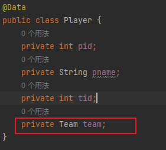

## 1. 一对一的延迟加载

1. 打开延迟加载配置

> 配置 Mybatis-Config.xml 文件：

```xml
    <settings>
        <!--配置日志-->
        <setting name="logImpl" value="STDOUT_LOGGING"/>
        <!-- 打开二级缓存-->
<!--        <setting name="cacheEnabled" value="true"/>-->
        <!-- 打开延迟加载-->
        <setting name="lazyLoadingEnabled" value="true"/>
    </settings>
```

2. 关联到属性的查询

```java
public interface TeamMapper {
    Team selectById(int tid);
}
```

> com.slz.generator.mapper.TeamMapper.selectById

```xml
    <resultMap id="PlayerLazyLoad" type="com.slz.generator.model.Player" autoMapping="true">
        <association property="team" column="tid" javaType="com.slz.generator.model.Team"
                     select="com.slz.generator.mapper.TeamMapper.selectById"
                     fetchType="lazy"></association>
    </resultMap>
    <select id="selectList" resultMap="PlayerLazyLoad">
        select *
        from player
    </select>
```

> 重点在 `select`

3. 使用验证

> 程序 1 ： 只打印队员姓名，不涉及访问 team 属性

```java
public class TestLazyLoad {
    public static void main(String[] args) throws IOException {
        SqlSession session = new SqlSessionFactoryBuilder().build(Resources.getResourceAsStream("Mybatis-Config.xml")).openSession();
        PlayerMapper mapper = session.getMapper(PlayerMapper.class);
        List<Player> players = mapper.selectList();
        players.forEach((p)->{
            System.out.println(p.getPname()); // 只打印队员姓名，不涉及访问 team 属性
        });
        session.close();
    }
}
```

> 结果 1 ：只执行一句 sql （team 属性延迟加载）

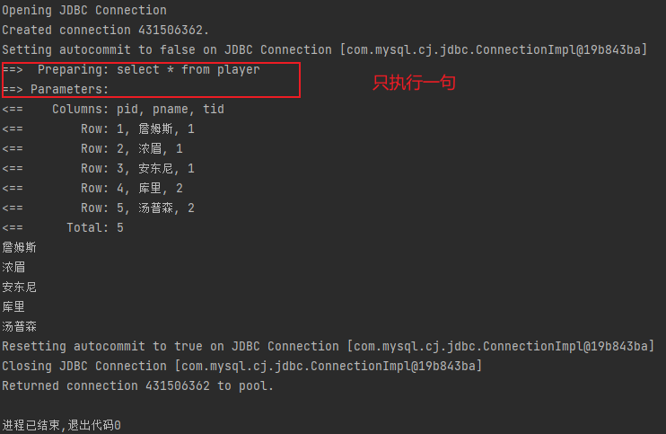

> 程序 2： 打印全部属性

```java
public class TestLazyLoad {
    public static void main(String[] args) throws IOException {
        SqlSession session = new SqlSessionFactoryBuilder().build(Resources.getResourceAsStream("Mybatis-Config.xml")).openSession();
        PlayerMapper mapper = session.getMapper(PlayerMapper.class);
        List<Player> players = mapper.selectList();
        players.forEach(System.out::println); // 打印全部属性
        session.close();
    }
}
```

> 结果 2： 执行了两次sql

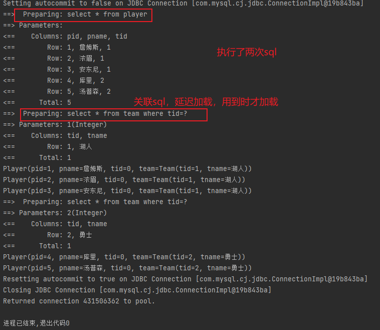

## 2. 一对多的延迟加载

> Team 对 Player 是一对多

```java
@Data
public class Team {
    private int tid;
    private String tname;
    private List<Player> players;
}
```

```xml
    <resultMap id="TeamLazyLoad" type="com.slz.generator.model.Team" autoMapping="true">
        <collection property="players" column="tid" ofType="com.slz.generator.model.Player"
                    select="com.slz.generator.mapper.PlayerMapper.selectByTid"
        fetchType="lazy"></collection>
    </resultMap>
    <select id="selectList" resultMap="TeamLazyLoad">
        select *
        from team
    </select>
```


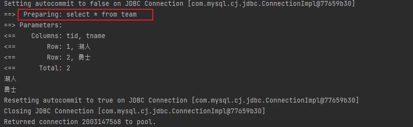

```java
public class TestLazyLoadOneToMore {
    public static void main(String[] args) throws IOException {
        SqlSession session = new SqlSessionFactoryBuilder().build(Resources.getResourceAsStream("Mybatis-Config.xml")).openSession();
        TeamMapper mapper = session.getMapper(TeamMapper.class);
        List<Team> teams = mapper.selectList();
//        teams.forEach(System.out::println);
        teams.forEach((t)->{
            System.out.println(t.getTname());
        });
        session.close();
    }
}
```

## 👀️ 使用注解开发

> 当数据库表字段名与对象的属性名对不上时，配置 ResultMap

```java
public interface StudentMapper {
    @Results(id="r", value = {
            @Result(id = true, column = "id", property = "id"),
            @Result(column = "name", property = "sname"),
            @Result(column = "age", property = "age"),
            @Result(column = "gender", property = "gender"),
    })
    @Select("select * from student")
    List<Student> selectList();

    @ResultMap(value = {"r"})
    @Select("select * from student")
    List<Student> selectAll();
}
```

# 十、mybatis 使用分页插件 pagehelper ⭐️

1. 在 pom.xml 导入依赖：pagehelper

```xml
    <dependency>
      <groupId>com.github.pagehelper</groupId>
      <artifactId>pagehelper</artifactId>
      <version>5.3.0</version>
    </dependency>
```

2. 配置 Mybatis-Config.xml

```xml
    <plugins>
        <plugin interceptor="com.github.pagehelper.PageInterceptor"></plugin>
    </plugins>
```

3. 使用 pageHelper 插件

```java
public class TestPageHelper {
    public static void main(String[] args) throws IOException {
        // 拿到 Session
        SqlSession session = new SqlSessionFactoryBuilder().build(Resources.getResourceAsStream("Mybatis-Config.xml")).openSession();
        // 拿到 mapper
        StudentMapper mapper = session.getMapper(StudentMapper.class);
        // 配置分页规则，这里获取第2分页，每页有3条数据\
        // 计算规则
        // limit x, z
        // z=pageSize
        // x = (pageNum -1)*z
        PageHelper.startPage(2, 3);
        // 查询数据
        List<Student> students = mapper.selectList();
        // 将从查询结果封装到 PageInfo 做分页处理
        PageInfo<Student> pageInfo = new PageInfo<>(students);
        // 通过 PageInfo 对象获取到 当前分页信息
        List<Student> list = pageInfo.getList();
        // 打印当前分页
        list.forEach(System.out::println);
        session.close();
    }
}
```

> 运行启动页面

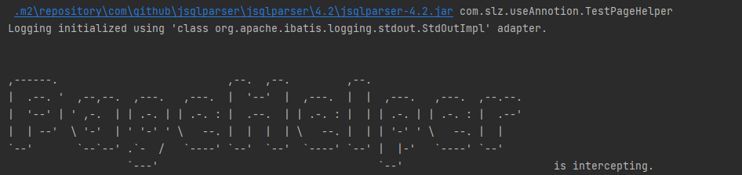


> 运行结果

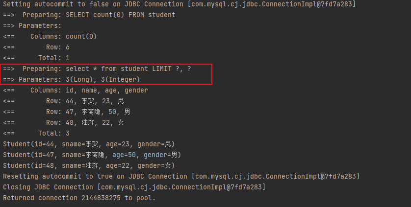
